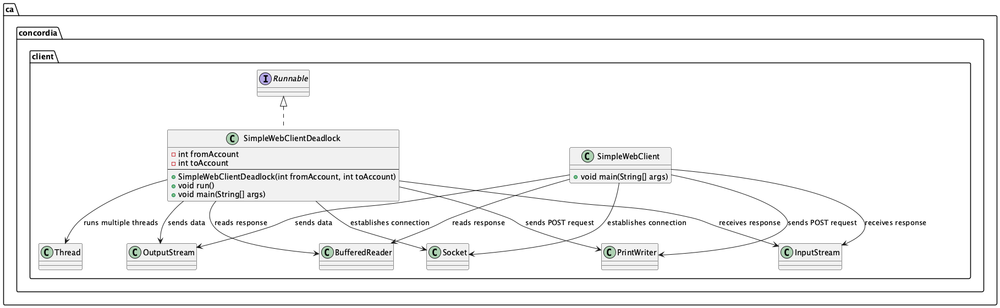

# Design Report: Prog_ass_2 Web Server

## Data Structures and Functions

### Server Package 

The server package involves the following data structures:

1. **Account**: A class representing a bank account, with the following attributes:
	* `balance`: an `AtomicInteger` to store the account balance
	* `id`: an `int` to store the account ID
2. **WebServer**: A class representing the web server, with the following attributes:
	* `accounts`: a `static Map<Integer, Account>` to store accounts, where the key is the account ID and the value is the corresponding `Account` object
	* `locks`: a `static Map<Integer, ReentrantLock>` to store locks for each account, where the key is the account ID and the value is the corresponding `ReentrantLock` object
	* `successfulTransactions`: a `static List<String>` to store successful transactions
	* `transactionCounter`: a `static int` to store the transaction counter

### Client Package

The client package involves the following data structures:

1. **SimpleWebClient**: A class representing a simple web client, with no attributes specified in the code.
2. **SimpleWebClientDeadlock**: A class representing a simple web client with deadlock detection, with the following attributes:
	* `fromAccount`: an `int` to store the from account ID
	* `toAccount`: an `int` to store the to account ID

## Algorithms

The algorithm used is as follows:

1. **Request Handling**: The `WebServer` class listens for incoming HTTP requests on a specified port (in this case, port 8000). When a request is received, it creates a new thread to handle the request.
2. **Request Parsing**: The `handleGetRequest` and `handlePostRequest` methods parse the incoming HTTP request to determine the type of request (GET or POST) and extract relevant information.
3. **Account Management**: For POST requests, the algorithm updates the account balance using the `processTransfer` method. This method uses a lock to synchronize access to the account balance.
4. **Transaction Management**: The algorithm also updates the `successfulTransactions` list and increments the `transactionCounter` when a transfer is successful.
5. **Response Generation**: The algorithm generates an HTTP response based on the request type and the outcome of the account update. The HTML page displays the transaction status or transaction form, the current account balances and the successful transaction history.

The algorithm satisfies the requirements of implementing multithreading, a fund transfer functionality, synchronization, and deadlock prevention. It uses a thread pool to handle incoming requests and synchronizes access to account balances using a combination of locks and atomic variables to prevent concurrent updates. Specifically, the Account class employs an AtomicInteger to store the account balance, allowing for thread-safe updates using atomic operations. Additionally, the WebServer class utilizes ReentrantLock instances to lock access to specific accounts, ensuring that only one thread can modify an account's balance at a time. This dual approach enables the system to efficiently handle concurrent requests while maintaining data consistency and preventing deadlocks.

## Rationale

The use of a combination of locks and atomic variables to synchronize access to account balances is a deliberate design choice to ensure data consistency and prevent deadlocks. By employing `ReentrantLock` instances to lock access to specific accounts, we ensure that only one thread can modify an account's balance at a time, preventing concurrent updates that could lead to data inconsistencies. Meanwhile, the use of `AtomicInteger` to store the account balance allows for thread-safe updates using atomic operations, further reducing the risk of data corruption. This dual approach enables the system to efficiently handle concurrent requests while maintaining data consistency and preventing deadlocks, making it a robust and reliable solution for managing account balances in a multithreaded environment.

In addition to the synchronization mechanism, the design of the `WebServer` class also takes into account debuggability and maintainability. The class includes methods to display account information and successful transaction history, making it easier to identify and resolve issues. Error handling blocks are also included to catch and handle exceptions that may occur during execution, providing valuable information for debugging purposes.

From a complexity perspective, the time complexity of the server code is primarily determined by the number of accounts and the number of concurrent requests. The `processTransfer` method has a time complexity of O(1) due to the use of atomic operations on the account balance, while the overall time complexity of the server code is O(n), where n is the number of accounts. The space complexity of the server code is also O(n), as the `accounts` map stores all accounts, and the `locks` map and `successfulTransactions` list store information related to each account.

While the current implementation is functional, it's worth noting that the `WebServer` class could be broken down into separate classes to improve maintainability and scalability. For example, a `TransactionHandler` class could be responsible for handling transactions, including updating account balances and managing locks, while a `DisplayHandler` class could be responsible for displaying account information and successful transaction history. This approach would make the solution more modular and easier to maintain, allowing for easier testing and debugging as each class can be tested independently.
